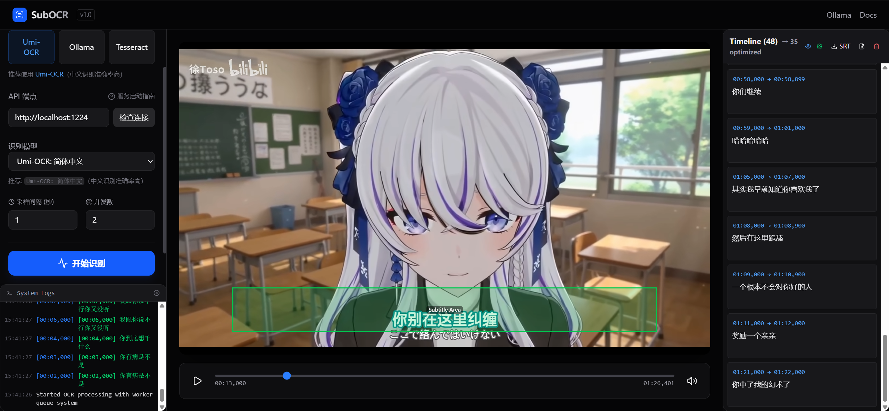

<div align="center">


# SubOCR - Video Subtitle OCR Extraction Tool

**A modern web application for extracting, optimizing, and correcting subtitles from videos using AI-powered OCR**

[](LICENSE)
[](https://react.dev/)
[](https://www.typescriptlang.org/)
[](https://vitejs.dev/)

</div>

## 🚀 Overview

SubOCR is a professional-grade web application that automates the extraction of subtitles from video files. It leverages multiple OCR backends (Umi-OCR, LM Studio, Tesseract) with AI-powered correction and optimization to produce accurate, time-synchronized subtitle files.

Perfect for content creators, translators, and anyone needing to extract text from videos with minimal manual effort.

## ✨ Features

- **Multi-OCR Backend Support**: Choose between Umi-OCR, LM Studio, or Tesseract for text recognition
- **Smart Subtitle Optimization**: Automatic deduplication, merging, and continuity correction
- **AI-Powered Correction**: Custom rule-based text correction with default patterns for common OCR errors
- **Real-time Processing**: Live progress tracking with detailed logs and statistics
- **Interactive Timeline**: Visual subtitle timeline with drag-and-drop adjustment
- **Video Preview**: Built-in video player with frame-by-frame navigation
- **Export Formats**: Save subtitles as SRT, VTT, or plain text
- **Modern UI**: Dark-themed interface with intuitive controls and responsive design
- **Worker-based Processing**: Offloads OCR tasks to Web Workers for smooth UI performance

## 📸 Screenshots


*Application interface showing video player, OCR settings, and subtitle timeline*

## 🛠️ Quick Start

### Prerequisites

- **Node.js** (v18 or later)
- **npm** or **yarn** or **bun**
- **OCR Backend** (Umi-OCR, LM Studio, or Tesseract - at least one must be running)

### Installation

1. **Clone the repository**
   ```bash
   git clone https://github.com/gasdyueer/subocr.git
   cd subocr
   ```

2. **Install dependencies**
   ```bash
   npm install
   # or
   yarn install
   # or
   bun install
   ```


3. **Start the development server**
   ```bash
   npm run dev
   # or
   yarn dev
   # or
   bun dev
   ```

4. **Open your browser** and navigate to `http://localhost:3000`

## ⚙️ Configuration

### OCR Backend Setup

SubOCR supports three OCR backends. You need to have at least one running:

#### Option 1: Umi-OCR (Recommended)
1. Download and run [Umi-OCR](https://github.com/hiroi-sora/Umi-OCR) locally
2. Ensure it's running on `http://localhost:1224` (default)
3. In SubOCR settings, select "Umi-OCR" as the backend

#### Option 2: LM Studio
1. Install [LM Studio](https://lmstudio.ai/)
2. Load the glm-ocr model in LM Studio application
3. Ensure LM Studio server is running on `http://localhost:1234`
4. In SubOCR settings, select "LM Studio" as the backend

#### Option 3: Tesseract
1. Install Tesseract OCR on your system
2. No additional service needed - runs locally in browser
3. In SubOCR settings, select "Tesseract" as the backend


## 🎮 Usage

### Basic Workflow

1. **Upload a Video**: Drag and drop a video file (MP4, MKV, MOV, WebM supported)
2. **Configure OCR Settings**:
   - Select OCR backend and model
   - Adjust processing interval (seconds per frame)
   - Set crop area if needed
   - Enable/disable optimization features
3. **Start Processing**: Click "Start OCR" to begin subtitle extraction
4. **Review & Edit**: Use the interactive timeline to adjust timings and text
5. **Export**: Save subtitles in your preferred format (SRT, VTT, TXT)

### Advanced Features

- **Crop Selection**: Define specific screen regions for OCR to improve accuracy
- **Deduplication**: Remove duplicate subtitles within configurable time windows
- **Subtitle Merging**: Combine short consecutive subtitles into coherent lines
- **Custom Correction Rules**: Add regex patterns for domain-specific text correction
- **Performance Optimization**: Adjust concurrency and timeouts for your hardware

## 🏗️ Architecture

```
src/
├── components/          # React components
│   ├── video/          # Video uploader and player
│   ├── ocr/            # OCR settings panel
│   ├── timeline/       # Subtitle timeline editor
│   └── logs/           # Processing log display
├── stores/             # Zustand state management
│   ├── useVideoStore.ts
│   ├── useOcrStore.ts
│   └── useSubtitleStore.ts
├── lib/                # Core utilities
│   ├── ocrApi.ts       # OCR backend communication
│   ├── ocr-corrector.ts # Text correction engine
│   ├── deduplication.ts # Duplicate detection
│   └── subtitle-optimizer.ts # Subtitle optimization
├── workers/            # Web Workers
│   ├── ocr.worker.ts   # OCR processing
│   ├── screenshot.worker.ts # Video frame extraction
│   └── worker-manager.ts # Worker orchestration
└── types/              # TypeScript definitions
```

## 🔧 Development

### Available Scripts

- `npm run dev` - Start development server
- `npm run build` - Build for production
- `npm run preview` - Preview production build
- `npm run lint` - Run TypeScript compiler checks
- `npm run clean` - Remove build artifacts

### Project Structure

- **Frontend**: React 19 + TypeScript + Vite + Tailwind CSS
- **State Management**: Zustand (lightweight state management)
- **UI Components**: Custom components with Framer Motion animations
- **Build Tool**: Vite with optimized configuration
- **Styling**: Tailwind CSS with custom design system

## 🤝 Contributing

We welcome contributions! Here's how you can help:

1. **Report Bugs**: Open an issue with detailed reproduction steps
2. **Suggest Features**: Share your ideas for improving SubOCR
3. **Submit Pull Requests**:
   - Fork the repository
   - Create a feature branch (`git checkout -b feature/amazing-feature`)
   - Commit your changes (`git commit -m 'Add amazing feature'`)
   - Push to the branch (`git push origin feature/amazing-feature`)
   - Open a Pull Request

### Development Guidelines

- Follow TypeScript best practices with strict type checking
- Use Tailwind CSS for styling (avoid inline styles)
- Write meaningful commit messages
- Update documentation for new features
- Add tests for critical functionality

## 📄 License

This project is licensed under the MIT License - see the [LICENSE](LICENSE) file for details.

## 🙏 Acknowledgements

- [Umi-OCR](https://github.com/hiroi-sora/Umi-OCR) - Excellent OCR engine
- [LM Studio](https://lmstudio.ai/) - Local LLM/OCR hosting
- [React](https://react.dev/) - UI library
- [Vite](https://vitejs.dev/) - Build tool
- [Tailwind CSS](https://tailwindcss.com/) - Styling framework

## 📞 Support

- **Issues**: [GitHub Issues](https://github.com/gasdyueer/subocr/issues)
- **Discussions**: [GitHub Discussions](https://github.com/gasdyueer/subocr/discussions)
- **Email**: your.email@example.com

---

<div align="center">
Made with ❤️ by the SubOCR team

If you find this project useful, please consider giving it a ⭐ on GitHub!
</div>
