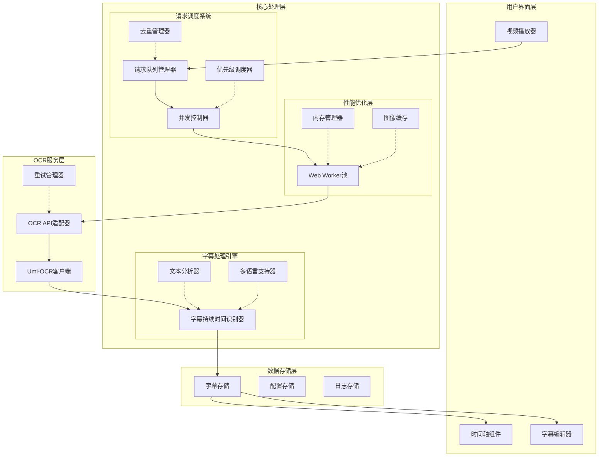

# 高速截图卡顿优化方案

## 1. 问题分析总结

### 1.1 当前问题
高速截图发送OCR请求导致UI卡顿，程序无法准确判断当前字幕的持续时间。

### 1.2 根本原因分析
1. **顺序处理模式**：必须等待前一帧定位完成才能处理下一帧
2. **固定字幕时长**：`endTime = startTime + config.interval`，不符合实际需求
3. **无请求管理**：可能同时发送大量请求导致服务过载
4. **无去重机制**：相同时间点可能被重复处理
5. **UI阻塞**：Canvas操作和OCR请求在主线程执行

## 2. 优化目标

### 2.1 核心目标
1. **减少卡顿**：提升UI响应速度，确保流畅的用户体验
2. **智能识别字幕持续时间**：基于文本内容动态计算合理显示时长
3. **优化请求调度**：实现请求队列、并发控制和去重机制
4. **提升处理效率**：支持批量处理和并行处理

### 2.2 性能指标
- UI响应延迟：< 100ms
- OCR请求并发控制：2-5个并行请求
- 内存使用：< 500MB（处理1小时视频）
- 处理速度：> 10帧/秒

## 3. 系统架构设计

### 3.1 优化后系统架构图



### 3.2 组件职责说明

#### 3.2.1 请求调度系统
- **请求队列管理器**：管理待处理的OCR请求，支持优先级排序
- **并发控制器**：控制同时进行的OCR请求数量，防止服务过载
- **去重管理器**：基于时间戳和图像哈希避免重复处理
- **优先级调度器**：根据时间戳和用户交互动态调整处理优先级

#### 3.2.2 字幕处理引擎
- **字幕持续时间识别器**：基于文本内容计算合理的显示时长
- **文本分析器**：分析文本长度、标点符号、语义分段
- **多语言支持器**：支持不同语言的阅读速度计算

#### 3.2.3 性能优化层
- **Web Worker池**：将Canvas操作和OCR请求移至Worker线程
- **内存管理器**：监控和优化内存使用，防止内存泄漏
- **图像缓存**：缓存已处理的图像，支持断点续传

## 4. 核心算法设计

### 4.1 字幕持续时间识别算法

#### 4.1.1 基础计算公式
```typescript
function calculateSubtitleDuration(text: string, language: string): number {
    // 基础阅读速度（字符/秒）
    const readingSpeed = getReadingSpeed(language);
    
    // 文本长度计算（考虑中英文差异）
    const effectiveLength = calculateEffectiveLength(text, language);
    
    // 基础时长 = 文本长度 / 阅读速度
    let baseDuration = effectiveLength / readingSpeed;
    
    // 标点符号调整
    baseDuration = adjustForPunctuation(baseDuration, text);
    
    // 语义分段调整
    baseDuration = adjustForSemanticSegments(baseDuration, text);
    
    // 最小和最大时长限制
    return clampDuration(baseDuration, language);
}
```

#### 4.1.2 阅读速度配置
```typescript
const READING_SPEEDS = {
    'zh-CN': 4.0,    // 中文：4字符/秒
    'en-US': 3.0,    // 英文：3单词/秒 ≈ 15字符/秒
    'ja-JP': 3.5,    // 日文：3.5字符/秒
    'ko-KR': 3.5,    // 韩文：3.5字符/秒
    'default': 3.0   // 默认：3字符/秒
};

function getReadingSpeed(language: string): number {
    return READING_SPEEDS[language] || READING_SPEEDS.default;
}
```

#### 4.1.3 有效长度计算
```typescript
function calculateEffectiveLength(text: string, language: string): number {
    switch (language) {
        case 'zh-CN':
            // 中文：每个汉字计为1，标点符号计为0.5
            return countChineseCharacters(text) + countPunctuation(text) * 0.5;
        
        case 'en-US':
            // 英文：每个单词计为1，考虑平均单词长度5个字符
            return countWords(text) * 5;
        
        default:
            // 其他语言：按字符计数
            return text.length;
    }
}
```

#### 4.1.4 标点符号调整
```typescript
function adjustForPunctuation(baseDuration: number, text: string): number {
    const punctuationPattern = /[。！？；：]/g;
    const matches = text.match(punctuationPattern);
    
    if (!matches) return baseDuration;
    
    // 每个完整标点增加0.3秒思考时间
    const punctuationBonus = matches.length * 0.3;
    
    // 逗号、分号等半标点增加0.1秒
    const semiPunctuationPattern = /[，、]/g;
    const semiMatches = text.match(semiPunctuationPattern);
    const semiBonus = (semiMatches?.length || 0) * 0.1;
    
    return baseDuration + punctuationBonus + semiBonus;
}
```

#### 4.1.5 语义分段调整
```typescript
function adjustForSemanticSegments(baseDuration: number, text: string): number {
    // 检测语义分段（基于标点和连接词）
    const segments = splitIntoSemanticSegments(text);
    
    if (segments.length <= 1) return baseDuration;
    
    // 每个分段增加0.5秒上下文切换时间
    const segmentBonus = (segments.length - 1) * 0.5;
    
    return baseDuration + segmentBonus;
}
```

### 4.2 智能字幕合并算法

#### 4.2.1 连续字幕检测
```typescript
function detectContinuousSubtitles(
    currentSubtitle: Subtitle,
    previousSubtitle: Subtitle,
    maxGap: number = 0.5 // 最大间隔时间（秒）
): boolean {
    // 检查时间连续性
    const timeGap = currentSubtitle.startTime - previousSubtitle.endTime;
    
    // 检查文本相似性（避免合并不同内容）
    const textSimilarity = calculateTextSimilarity(
        currentSubtitle.text,
        previousSubtitle.text
    );
    
    return timeGap <= maxGap && textSimilarity > 0.7;
}
```

#### 4.2.2 自动合并策略
```typescript
function autoMergeSubtitles(subtitles: Subtitle[]): Subtitle[] {
    const merged: Subtitle[] = [];
    
    for (let i = 0; i < subtitles.length; i++) {
        let current = subtitles[i];
        
        // 尝试向后合并
        while (i + 1 < subtitles.length) {
            const next = subtitles[i + 1];
            
            if (shouldMerge(current, next)) {
                current = mergeTwoSubtitles(current, next);
                i++; // 跳过已合并的字幕
            } else {
                break;
            }
        }
        
        merged.push(current);
    }
    
    return merged;
}
```

## 5. 请求调度器设计

### 5.1 队列管理架构

```typescript
interface OcrRequest {
    id: string;
    timestamp: number;      // 视频时间戳
    imageData: string;      // Base64图像数据
    imageHash: string;      // 图像哈希（用于去重）
    priority: number;       // 优先级（0-10）
    status: 'pending' | 'processing' | 'completed' | 'failed';
    retryCount: number;
    createdAt: number;
}

class RequestScheduler {
    private queue: OcrRequest[] = [];
    private processing: Map<string, OcrRequest> = new Map();
    private maxConcurrent: number;
    private completed: OcrRequest[] = [];
    
    constructor(maxConcurrent: number = 3) {
        this.maxConcurrent = maxConcurrent;
    }
    
    // 添加请求（自动去重）
    addRequest(request: OcrRequest): boolean {
        // 检查重复请求
        if (this.isDuplicate(request)) {
            return false;
        }
        
        // 插入队列（按优先级排序）
        this.insertByPriority(request);
        return true;
    }
    
    // 处理下一个请求
    async processNext(): Promise<void> {
        if (this.processing.size >= this.maxConcurrent) {
            return;
        }
        
        const request = this.getNextRequest();
        if (!request) return;
        
        request.status = 'processing';
        this.processing.set(request.id, request);
        
        try {
            const result = await this.executeOcr(request);
            request.status = 'completed';
            this.completed.push(request);
        } catch (error) {
            request.status = 'failed';
            this.handleFailedRequest(request, error);
        } finally {
            this.processing.delete(request.id);
            this.processNext(); // 继续处理下一个
        }
    }
    
    // 去重检查
    private isDuplicate(request: OcrRequest): boolean {
        // 基于时间戳的近似去重（±0.1秒）
        const timeThreshold = 0.1;
        
        return this.queue.some(req => 
            Math.abs(req.timestamp - request.timestamp) < timeThreshold
        ) || this.processing.has(request.id);
    }
}
```

### 5.2 并发控制策略

```typescript
class ConcurrencyController {
    private activeRequests = 0;
    private maxConcurrent: number;
    private queue: Array<() => Promise<void>> = [];
    
    constructor(maxConcurrent: number) {
        this.maxConcurrent = maxConcurrent;
    }
    
    async execute<T>(task: () => Promise<T>): Promise<T> {
        return new Promise((resolve, reject) => {
            const wrappedTask = async () => {
                try {
                    const result = await task();
                    resolve(result);
                } catch (error) {
                    reject(error);
                } finally {
                    this.activeRequests--;
                    this.processQueue();
                }
            };
            
            if (this.activeRequests < this.maxConcurrent) {
                this.activeRequests++;
                wrappedTask();
            } else {
                this.queue.push(wrappedTask);
            }
        });
    }
    
    private processQueue(): void {
        while (this.queue.length > 0 && this.activeRequests < this.maxConcurrent) {
            this.activeRequests++;
            const task = this.queue.shift();
            task?.();
        }
    }
}
```

### 5.3 优先级调度算法

```typescript
function calculatePriority(request: OcrRequest, context: SchedulingContext): number {
    let priority = 5; // 基础优先级
    
    // 1. 时间因素：越接近当前播放时间，优先级越高
    const timeDiff = Math.abs(request.timestamp - context.currentPlayTime);
    if (timeDiff < 2) priority += 3;
    else if (timeDiff < 5) priority += 1;
    
    // 2. 用户交互：用户手动触发的请求优先级最高
    if (request.priority > 7) priority = Math.max(priority, request.priority);
    
    // 3. 重试次数：失败次数越多，优先级适当降低（避免卡住）
    if (request.retryCount > 0) priority -= Math.min(request.retryCount, 2);
    
    // 4. 批量处理：连续时间段的请求保持相近优先级
    if (context.isBatchProcessing) priority -= 1;
    
    return Math.max(1, Math.min(10, priority));
}
```

## 6. 性能优化策略

### 6.1 Web Worker架构

#### 6.1.1 Worker池设计
```typescript
class WorkerPool {
    private workers: Worker[] = [];
    private taskQueue: Array<{
        task: any;
        resolve: (value: any) => void;
        reject: (error: any) => void;
    }> = [];
    private workerStatus: boolean[] = [];
    
    constructor(poolSize: number = 4) {
        for (let i = 0; i < poolSize; i++) {
            const worker = new Worker('./ocr-worker.js');
            worker.onmessage = this.handleWorkerResponse.bind(this, i);
            worker.onerror = this.handleWorkerError.bind(this, i);
            this.workers.push(worker);
            this.workerStatus.push(true); // 空闲
        }
    }
    
    // 分配任务
    executeTask<T>(task: OcrTask): Promise<T> {
        return new Promise((resolve, reject) => {
            const taskItem = { task, resolve, reject };
            
            const availableWorkerIndex = this.workerStatus.findIndex(status => status);
            if (availableWorkerIndex !== -1) {
                this.assignTaskToWorker(availableWorkerIndex, taskItem);
            } else {
                this.taskQueue.push(taskItem);
            }
        });
    }
    
    // Worker任务处理
    private assignTaskToWorker(workerIndex: number, taskItem: any): void {
        this.workerStatus[workerIndex] = false;
        this.workers[workerIndex].postMessage({
            type: 'process',
            data: taskItem.task
        });
    }
}
```

#### 6.1.2 Worker任务类型
```javascript
// ocr-worker.js
self.onmessage = async (event) => {
    const { type, data } = event.data;
    
    switch (type) {
        case 'process':
            try {
                // 1. Canvas操作：图像裁剪和压缩
                const processedImage = await processImage(data.imageData);
                
                // 2. OCR请求
                const ocrResult = await performOcrRequest(processedImage);
                
                // 3. 文本处理
                const subtitle = processOcrResult(ocrResult, data.timestamp);
                
                self.postMessage({
                    type: 'success',
                    data: subtitle
                });
            } catch (error) {
                self.postMessage({
                    type: 'error',
                    error: error.message
                });
            }
            break;
            
        case 'batch_process':
            // 批量处理逻辑
            break;
    }
};
```

### 6.2 内存管理机制

#### 6.2.1 图像缓存策略
```typescript
class ImageCache {
    private cache: Map<string, {
        data: string;
        timestamp: number;
        size: number;
        lastAccessed: number;
    }> = new Map();
    
    private maxSize: number; // 最大缓存大小（字节）
    private currentSize: number = 0;
    
    constructor(maxSizeMB: number = 100) {
        this.maxSize = maxSizeMB * 1024 * 1024; // 转换为字节
    }
    
    // 添加图像到缓存
    set(key: string, imageData: string): void {
        const size = this.calculateSize(imageData);
        
        // 检查是否需要清理
        if (this.currentSize + size > this.maxSize) {
            this.cleanup();
        }
        
        this.cache.set(key, {
            data: imageData,
            timestamp: Date.now(),
            size,
            lastAccessed: Date.now()
        });
        
        this.currentSize += size;
    }
    
    // 清理策略：LRU（最近最少使用）
    private cleanup(): void {
        const entries = Array.from(this.cache.entries());
        entries.sort((a, b) => a[1].lastAccessed - b[1].lastAccessed);
        
        let freedSize = 0;
        const targetFree = this.maxSize * 0.3; // 清理30%的空间
        
        for (const [key, value] of entries) {
            if (freedSize >= targetFree) break;
            
            this.cache.delete(key);
            freedSize += value.size;
            this.currentSize -= value.size;
        }
    }
}
```

#### 6.2.2 内存监控
```typescript
class MemoryMonitor {
    private samples: number[] = [];
    private maxSamples: number = 100;
    private warningThreshold: number = 0.8; // 80%内存使用率
    
    monitor(): void {
        if (typeof performance !== 'undefined' && performance.memory) {
            const memory = performance.memory;
            const usedRatio = memory.usedJSHeapSize / memory.jsHeapSizeLimit;
            
            this.samples.push(usedRatio);
            if (this.samples.length > this.maxSamples) {
                this.samples.shift();
            }
            
            // 检查内存使用趋势
            if (this.isMemoryIncreasing()) {
                console.warn('内存使用持续增加，建议清理缓存');
                this.triggerCleanup();
            }
            
            if (usedRatio > this.warningThreshold) {
                console.error(`内存使用率过高: ${(usedRatio * 100).toFixed(1)}%`);
                this.triggerEmergencyCleanup();
            }
        }
    }
    
    private isMemoryIncreasing(): boolean {
        if (this.samples.length < 10) return false;
        
        const recent = this.samples.slice(-10);
        const trend = this.calculateTrend(recent);
        return trend > 0.1; // 上升趋势超过10%
    }
}
```

### 6.3 UI更新优化

#### 6.3.1 增量更新策略
```typescript
class IncrementalUpdater {
    private updateQueue: Array<() => void> = [];
    private isUpdating: boolean = false;
    private updateInterval: number = 100; // 100ms更新一次
    
    scheduleUpdate(updateFn: () => void): void {
        this.updateQueue.push(updateFn);
        
        if (!this.isUpdating) {
            this.startUpdateCycle();
        }
    }
    
    private startUpdateCycle(): void {
        this.isUpdating = true;
        
        const update = () => {
            if (this.updateQueue.length === 0) {
                this.isUpdating = false;
                return;
            }
            
            // 每次更新执行最多5个任务
            const batchSize = Math.min(5, this.updateQueue.length);
            for (let i = 0; i < batchSize; i++) {
                const updateFn = this.updateQueue.shift();
                updateFn?.();
            }
            
            // 使用requestAnimationFrame进行下一轮更新
            requestAnimationFrame(() => {
                setTimeout(update, this.updateInterval);
            });
        };
        
        update();
    }
}
```

#### 6.3.2 虚拟滚动优化
```typescript
class VirtualScrollManager {
    private visibleRange: { start: number; end: number } = { start: 0, end: 50 };
    private itemHeight: number = 40;
    private containerHeight: number = 0;
    
    updateVisibleRange(scrollTop: number): void {
        const startIndex = Math.floor(scrollTop / this.itemHeight);
        const endIndex = Math.min(
            startIndex + Math.ceil(this.containerHeight / this.itemHeight) + 5,
            this.totalItems
        );
        
        this.visibleRange = { start: startIndex, end: endIndex };
        this.renderVisibleItems();
    }
    
    renderVisibleItems(): void {
        // 只渲染可见区域的项目
        for (let i = this.visibleRange.start; i < this.visibleRange.end; i++) {
            this.renderItem(i);
        }
        
        // 回收不可见的项目
        this.recycleInvisibleItems();
    }
}
```

## 7. 错误处理和恢复机制

### 7.1 智能重试策略

```typescript
class SmartRetryManager {
    private retryConfig = {
        maxRetries: 3,
        baseDelay: 1000,
        maxDelay: 10000,
        backoffFactor: 2,
        retryableErrors: ['timeout', 'network_error', 'server_busy']
    };
    
    async executeWithRetry<T>(
        operation: () => Promise<T>,
        context: RetryContext
    ): Promise<T> {
        let lastError: Error;
        
        for (let attempt = 1; attempt <= this.retryConfig.maxRetries; attempt++) {
            try {
                return await operation();
            } catch (error: any) {
                lastError = error;
                
                // 检查是否可重试的错误
                if (!this.isRetryableError(error)) {
                    throw error;
                }
                
                // 计算延迟时间（指数退避）
                const delay = this.calculateDelay(attempt);
                
                // 最后一次尝试前记录日志
                if (attempt === this.retryConfig.maxRetries) {
                    console.warn(`最后一次重试尝试，延迟 ${delay}ms`);
                }
                
                await this.delay(delay);
            }
        }
        
        throw lastError!;
    }
    
    private isRetryableError(error: Error): boolean {
        const errorMessage = error.message.toLowerCase();
        return this.retryConfig.retryableErrors.some(
            retryableError => errorMessage.includes(retryableError)
        );
    }
    
    private calculateDelay(attempt: number): number {
        const delay = this.retryConfig.baseDelay *
                     Math.pow(this.retryConfig.backoffFactor, attempt - 1);
        return Math.min(delay, this.retryConfig.maxDelay);
    }
}
```

### 7.2 断点续传机制

```typescript
class CheckpointManager {
    private checkpoints: Map<string, Checkpoint> = new Map();
    
    saveCheckpoint(taskId: string, checkpoint: Checkpoint): void {
        this.checkpoints.set(taskId, {
            ...checkpoint,
            savedAt: Date.now()
        });
        
        // 持久化到本地存储
        localStorage.setItem(`checkpoint_${taskId}`, JSON.stringify(checkpoint));
    }
    
    loadCheckpoint(taskId: string): Checkpoint | null {
        // 先从内存中查找
        const memoryCheckpoint = this.checkpoints.get(taskId);
        if (memoryCheckpoint) return memoryCheckpoint;
        
        // 从本地存储恢复
        const stored = localStorage.getItem(`checkpoint_${taskId}`);
        if (stored) {
            try {
                return JSON.parse(stored);
            } catch (e) {
                console.error('恢复检查点失败:', e);
            }
        }
        
        return null;
    }
    
    resumeFromCheckpoint(taskId: string): Promise<void> {
        const checkpoint = this.loadCheckpoint(taskId);
        if (!checkpoint) {
            throw new Error('没有可用的检查点');
        }
        
        console.log(`从检查点恢复: ${checkpoint.progress}% 完成`);
        return this.resumeProcessing(checkpoint);
    }
}
```

### 7.3 错误隔离机制

```typescript
class ErrorIsolationManager {
    private errorBuckets: Map<string, ErrorBucket> = new Map();
    private isolationThreshold: number = 5; // 5分钟内最多3次错误
    
    trackError(component: string, error: Error): void {
        const bucketId = this.getBucketId(component);
        let bucket = this.errorBuckets.get(bucketId);
        
        if (!bucket) {
            bucket = {
                component,
                errors: [],
                lastReset: Date.now()
            };
            this.errorBuckets.set(bucketId, bucket);
        }
        
        bucket.errors.push({
            error,
            timestamp: Date.now()
        });
        
        // 清理过期错误
        this.cleanupOldErrors(bucket);
        
        // 检查是否需要隔离
        if (this.shouldIsolate(bucket)) {
            this.isolateComponent(component);
        }
    }
    
    private shouldIsolate(bucket: ErrorBucket): boolean {
        const recentErrors = bucket.errors.filter(
            e => Date.now() - e.timestamp < 5 * 60 * 1000 // 5分钟内
        );
        
        return recentErrors.length >= this.isolationThreshold;
    }
    
    private isolateComponent(component: string): void {
        console.warn(`隔离组件: ${component}`);
        // 停止该组件的所有处理
        // 通知用户
        // 尝试自动恢复或等待手动干预
    }
}
```

## 8. 实施路线图

### 8.1 阶段一：基础架构升级（1-2周）

#### 目标
1. 实现Web Worker基础架构
2. 建立请求队列管理系统
3. 添加基础的内存监控

#### 具体任务
1. **创建Worker池管理器**
   - 实现Worker创建和销毁
   - 添加任务分配逻辑
   - 实现Worker状态监控

2. **实现请求队列**
   - 设计队列数据结构
   - 实现优先级排序
   - 添加基础去重机制

3. **集成内存管理**
   - 添加内存使用监控
   - 实现基础缓存清理
   - 添加内存警告机制

### 8.2 阶段二：智能字幕处理（1周）

#### 目标
1. 实现字幕持续时间识别算法
2. 添加多语言支持
3. 实现字幕合并逻辑

#### 具体任务
1. **开发字幕持续时间计算器**
   - 实现基础阅读速度模型
   - 添加标点符号调整
   - 实现语义分段检测

2. **多语言支持**
   - 添加语言检测
   - 配置不同语言的阅读速度
   - 测试多语言场景

3. **字幕合并优化**
   - 实现连续字幕检测
   - 添加相似度计算
   - 实现自动合并逻辑

### 8.3 阶段三：高级调度优化（1周）

#### 目标
1. 完善并发控制
2. 实现智能重试机制
3. 添加断点续传支持

#### 具体任务
1. **并发控制器增强**
   - 实现动态并发调整
   - 添加流量控制
   - 优化资源分配

2. **智能重试系统**
   - 实现指数退避
   - 添加错误分类
   - 实现重试策略配置

3. **断点续传机制**
   - 设计检查点格式
   - 实现状态保存/恢复
   - 添加进度持久化

### 8.4 阶段四：UI/UX优化（3-5天）

#### 目标
1. 优化UI响应速度
2. 添加进度反馈
3. 改善用户体验

#### 具体任务
1. **增量UI更新**
   - 实现批量更新
   - 添加虚拟滚动
   - 优化渲染性能

2. **进度反馈系统**
   - 添加实时进度显示
   - 实现预估时间计算
   - 添加完成通知

3. **用户体验改进**
   - 优化错误提示
   - 添加操作指引
   - 改善交互反馈

### 8.5 阶段五：测试和优化（1周）

#### 目标
1. 全面测试系统稳定性
2. 性能调优
3. 问题修复和优化

#### 具体任务
1. **压力测试**
   - 测试高并发场景
   - 验证内存管理
   - 测试长时间运行稳定性

2. **性能优化**
   - 分析性能瓶颈
   - 优化关键路径
   - 调整配置参数

3. **兼容性测试**
   - 测试不同浏览器
   - 验证不同视频格式
   - 测试不同OCR服务

## 9. 风险评估和缓解措施

### 9.1 技术风险

| 风险 | 影响程度 | 发生概率 | 缓解措施 |
|------|----------|----------|----------|
| Web Worker兼容性问题 | 中 | 低 | 提供降级方案，在主线程运行 |
| 内存泄漏 | 高 | 中 | 实现严格的内存监控和自动清理 |
| OCR服务不稳定 | 高 | 中 | 实现多级重试和备用服务 |
| 并发控制失效 | 中 | 低 | 添加熔断机制和限流保护 |
| 数据丢失 | 高 | 低 | 实现检查点机制和自动备份 |

### 9.2 性能风险

| 风险 | 影响程度 | 发生概率 | 缓解措施 |
|------|----------|----------|----------|
| UI卡顿未完全解决 | 高 | 中 | 持续监控和优化，添加性能分析工具 |
| 处理速度不达标 | 中 | 中 | 优化算法，添加并行处理，使用硬件加速 |
| 内存占用过高 | 高 | 中 | 实现智能缓存和内存压缩 |
| 网络延迟影响 | 中 | 高 | 添加本地缓存，优化请求合并 |

### 9.3 用户体验风险

| 风险 | 影响程度 | 发生概率 | 缓解措施 |
|------|----------|----------|----------|
| 操作复杂度增加 | 中 | 低 | 提供简化模式，添加操作指引 |
| 学习成本高 | 低 | 低 | 提供详细文档和教程视频 |
| 功能不直观 | 中 | 中 | 进行用户测试，优化界面设计 |
| 错误信息不清晰 | 低 | 中 | 提供友好的错误提示和解决方案 |

### 9.4 实施风险

| 风险 | 影响程度 | 发生概率 | 缓解措施 |
|------|----------|----------|----------|
| 开发时间超出预期 | 中 | 中 | 分阶段实施，优先核心功能 |
| 团队技能不足 | 低 | 低 | 提供培训，引入外部专家 |
| 集成问题 | 中 | 中 | 充分测试，制定回滚计划 |
| 依赖服务变更 | 低 | 低 | 抽象接口，减少直接依赖 |

## 10. 成功指标和验收标准

### 10.1 性能指标
1. **UI响应时间**：用户操作到界面反馈 < 100ms
2. **OCR处理速度**：平均 > 10帧/秒（取决于硬件和网络）
3. **内存使用**：处理1小时视频 < 500MB
4. **CPU占用**：平均 < 30%（在后台处理时）
5. **网络请求**：并发数控制在2-5个，成功率 > 95%

### 10.2 功能指标
1. **字幕持续时间准确性**：与实际显示时间误差 < 20%
2. **去重效果**：重复处理减少 > 80%
3. **错误恢复**：系统崩溃后恢复进度 > 90%
4. **多语言支持**：支持至少5种主要语言
5. **用户体验**：用户满意度评分 > 4/5

### 10.3 稳定性指标
1. **系统可用性**：> 99.5%
2. **平均无故障时间**：> 24小时
3. **错误率**：OCR处理错误率 < 5%
4. **恢复时间**：从错误中恢复 < 30秒

## 11. 监控和运维

### 11.1 监控指标
```typescript
interface MonitoringMetrics {
    // 性能指标
    uiResponseTime: number[];
    ocrProcessingTime: number[];
    memoryUsage: number[];
    cpuUsage: number[];
    
    // 业务指标
    framesProcessed: number;
    subtitlesGenerated: number;
    errorRate: number;
    successRate: number;
    
    // 系统指标
    workerCount: number;
    queueLength: number;
    concurrentRequests: number;
}
```

### 11.2 告警机制
1. **性能告警**：当UI响应时间 > 200ms时触发
2. **内存告警**：当内存使用 > 80%时触发
3. **错误告警**：当错误率 > 10%时触发
4. **服务告警**：当OCR服务不可用时触发

### 11.3 日志系统
1. **操作日志**：记录用户关键操作
2. **性能日志**：记录性能指标和趋势
3. **错误日志**：详细记录错误信息和上下文
4. **调试日志**：开发调试使用，可动态开启

## 12. 总结

本优化方案针对高速截图卡顿问题提出了全面的解决方案，包括：

1. **架构优化**：引入Web Worker和请求调度系统，将耗时操作移出主线程
2. **算法改进**：实现智能字幕持续时间识别，提升字幕准确性
3. **性能提升**：通过并发控制、内存管理和缓存策略优化性能
4. **稳定性增强**：添加错误处理、重试机制和断点续传
5. **用户体验**：优化UI响应，提供实时反馈和进度显示

实施本方案将显著提升系统的处理能力和用户体验，为后续功能扩展奠定坚实基础。

---
**文档版本**: 1.0
**创建日期**: 2026-02-28
**最后更新**: 2026-02-28
**状态**: 完成，待评审

**下一步行动**：
1. 评审本设计方案
2. 制定详细实施计划
3. 分配开发任务
4. 开始分阶段实施
