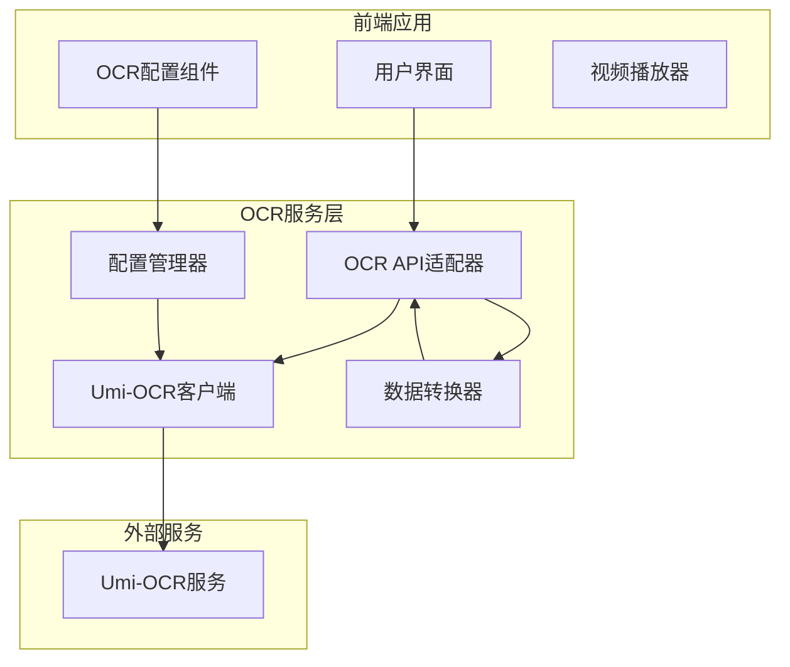

# OCR API 迁移计划

## 1. 项目概述

### 1.1 当前状态分析
- **当前实现**: 基于Ollama LLM的OCR系统
  - 使用`/api/generate`接口进行文本识别
  - 返回纯文本结果，无位置信息
  - 固定配置参数，无动态参数查询
  - 依赖LLM模型进行OCR，非专用OCR引擎

- **目标标准**: Umi-OCR API标准
  - 专用OCR引擎，支持多语言
  - 动态参数查询接口 (`/api/ocr/get_options`)
  - 标准OCR识别接口 (`/api/ocr`)
  - 返回详细位置信息、置信度等元数据
  - 支持多种数据格式输出

### 1.2 迁移目标
1. **完全替换**现有Ollama实现
2. **保证OCR可用性**为首要目标
3. **实现Umi-OCR标准API**兼容性
4. **提升OCR精度和功能**完整性

## 2. 架构设计

### 2.1 系统架构图



### 2.2 核心组件设计

#### 2.2.1 OCR API适配器
- **职责**: 提供统一的OCR接口，兼容现有调用方式
- **功能**:
  - 接收Base64图像数据
  - 调用Umi-OCR服务
  - 转换响应格式
  - 错误处理和重试机制

#### 2.2.2 Umi-OCR客户端
- **职责**: 与Umi-OCR服务通信
- **功能**:
  - 参数查询接口调用
  - OCR识别接口调用
  - 连接状态检测
  - 超时和错误处理

#### 2.2.3 配置管理器
- **职责**: 管理OCR配置参数
- **功能**:
  - 存储Umi-OCR参数映射
  - 提供默认配置
  - 参数验证和转换

#### 2.2.4 数据转换器
- **职责**: 数据格式转换
- **功能**:
  - Umi-OCR响应转换为应用格式
  - 位置信息模拟生成
  - 置信度计算

## 3. 接口设计

### 3.1 参数查询接口 (`/api/ocr/get_options` 适配)

```typescript
interface UmiOcrParameter {
  title: string;
  toolTip?: string;
  default: any;
  type: 'enum' | 'boolean' | 'text' | 'number' | 'var';
  optionsList?: Array<[string, string]>;
  isInt?: boolean;
}

interface UmiOcrOptions {
  [key: string]: UmiOcrParameter;
}

// 适配器接口
async function getUmiOcrOptions(endpoint: string): Promise<UmiOcrOptions>;
```

### 3.2 OCR识别接口 (`/api/ocr` 适配)

```typescript
interface UmiOcrRequest {
  base64: string;
  options?: {
    [key: string]: any;
  };
}

interface UmiOcrTextBlock {
  text: string;
  score: number;  // 置信度 0-1
  box: [[number, number], [number, number], [number, number], [number, number]];
  end: string;  // 结束符: '', ' ', '\n'
}

interface UmiOcrResponse {
  code: number;  // 100:成功, 101:无文本, 其他:失败
  data: UmiOcrTextBlock[] | string;
  time: number;  // 识别耗时(秒)
  timestamp: number;  // 任务开始时间戳
}

// 适配器接口
async function performUmiOcr(
  imageDataBase64: string,
  options?: Record<string, any>
): Promise<UmiOcrResponse>;
```

### 3.3 向后兼容接口

```typescript
// 保持现有接口签名，内部调用Umi-OCR
async function performOcr(
  imageDataBase64: string,
  config: OcrConfig
): Promise<string> {
  // 转换为Umi-OCR请求
  // 调用Umi-OCR服务
  // 提取纯文本返回
}
```

## 4. 数据格式转换策略

### 4.1 响应格式转换

#### 4.1.1 Umi-OCR响应到纯文本
```typescript
function extractTextFromUmiResponse(response: UmiOcrResponse): string {
  if (response.code === 101) {
    return ''; // 无文本
  }
  
  if (response.code !== 100) {
    throw new Error(`OCR失败: ${response.data}`);
  }
  
  if (typeof response.data === 'string') {
    return response.data;
  }
  
  // 拼接所有文本块
  return response.data
    .map(block => block.text + (block.end || ''))
    .join('');
}
```

#### 4.1.2 位置信息模拟
由于Ollama不提供位置信息，需要为Umi-OCR响应生成模拟位置信息：

```typescript
function generateMockBox(text: string, index: number): Box {
  // 基于文本长度和索引生成模拟位置
  const charWidth = 10;
  const lineHeight = 20;
  const x = 50;
  const y = 50 + index * lineHeight;
  const width = text.length * charWidth;
  
  return [
    [x, y],
    [x + width, y],
    [x + width, y + lineHeight],
    [x, y + lineHeight]
  ];
}
```

#### 4.1.3 置信度计算
```typescript
function calculateConfidence(text: string): number {
  // 基于文本长度、字符类型等计算模拟置信度
  const lengthScore = Math.min(text.length / 100, 1);
  const charTypeScore = /[\u4e00-\u9fa5]/.test(text) ? 0.9 : 0.8;
  return (lengthScore + charTypeScore) / 2;
}
```

### 4.2 配置参数映射

#### 4.2.1 Ollama配置到Umi-OCR参数
```typescript
const configMapping = {
  // 语言/模型映射
  model: {
    'llama3.2:latest': 'models/config_en.txt',
    'qwen2.5:latest': 'models/config_chinese.txt',
    // 更多模型映射...
  },
  
  // 温度参数映射
  temperature: (temp: number) => ({
    'ocr.cls': temp > 0.7, // 高温时启用方向纠正
    'tbpu.parser': temp > 0.7 ? 'multi_para' : 'single_line'
  })
};
```

## 5. 配置管理

### 5.1 默认配置
```typescript
const defaultUmiOcrOptions = {
  'ocr.language': 'models/config_chinese.txt',
  'ocr.cls': false,
  'ocr.limit_side_len': 960,
  'tbpu.parser': 'multi_para',
  'data.format': 'text', // 默认返回纯文本，兼容现有系统
  'tbpu.ignoreArea': []
};
```

### 5.2 配置存储
- **位置**: `src/config/umi-ocr-config.yaml`
- **格式**: YAML，便于维护和扩展
- **内容**: 参数定义、默认值、映射规则

### 5.3 运行时配置
- **环境变量**: UMI_OCR_ENDPOINT, UMI_OCR_PORT
- **用户配置**: 通过UI界面调整参数
- **动态加载**: 支持热更新配置

## 6. 实施步骤

### 阶段一：基础架构搭建 (预计2-3天)
1. **创建Umi-OCR客户端模块**
   - 实现参数查询接口
   - 实现OCR识别接口
   - 添加连接测试功能

2. **设计配置管理系统**
   - 创建配置文件和类型定义
   - 实现配置加载和验证
   - 添加默认参数映射

3. **搭建测试环境**
   - 部署Umi-OCR服务
   - 创建测试用例
   - 验证基础功能

### 阶段二：数据转换层实现 (预计1-2天)
1. **实现响应格式转换**
   - Umi-OCR响应到纯文本
   - 模拟位置信息生成
   - 置信度计算逻辑

2. **实现配置参数转换**
   - Ollama配置到Umi-OCR参数映射
   - 动态参数调整
   - 错误处理和回退机制

### 阶段三：适配器层集成 (预计2天)
1. **修改现有OCR API**
   - 替换Ollama调用为Umi-OCR调用
   - 保持接口向后兼容
   - 更新错误处理逻辑

2. **更新UI组件**
   - 修改OCR设置界面
   - 添加Umi-OCR参数配置
   - 更新状态显示

### 阶段四：测试和优化 (预计2-3天)
1. **功能测试**
   - 单元测试覆盖核心功能
   - 集成测试验证端到端流程
   - 性能测试评估响应时间

2. **兼容性测试**
   - 验证向后兼容性
   - 测试不同图像类型
   - 验证错误处理

3. **优化和调整**
   - 性能优化
   - 参数调优
   - 用户体验改进

## 7. 风险评估和缓解措施

### 7.1 技术风险
| 风险 | 影响 | 概率 | 缓解措施 |
|------|------|------|----------|
| Umi-OCR服务不稳定 | 高 | 中 | 实现重试机制，添加备用服务 |
| 位置信息缺失 | 中 | 高 | 提供模拟位置信息，标记为模拟数据 |
| 性能下降 | 中 | 中 | 优化图像预处理，添加缓存机制 |
| 配置复杂性 | 低 | 高 | 提供简化配置界面，预设常用配置 |

### 7.2 业务风险
| 风险 | 影响 | 概率 | 缓解措施 |
|------|------|------|----------|
| OCR精度下降 | 高 | 低 | 保留Ollama作为备选，A/B测试验证 |
| 用户学习成本 | 中 | 中 | 提供详细文档，简化配置流程 |
| 迁移期间服务中断 | 高 | 低 | 分阶段迁移，保持向后兼容 |

## 8. 测试策略

### 8.1 测试类型
1. **单元测试**: 核心功能模块测试
2. **集成测试**: 服务间通信测试
3. **端到端测试**: 完整OCR流程测试
4. **性能测试**: 响应时间和资源使用测试
5. **兼容性测试**: 不同图像格式和大小测试

### 8.2 测试数据
- **测试图像库**: 包含多种类型图像
  - 清晰文本图像
  - 模糊/低质量图像
  - 多语言文本图像
  - 复杂背景图像
- **基准测试**: 与Ollama结果对比

### 8.3 验收标准
1. **功能完整性**: 所有Umi-OCR标准接口实现
2. **性能要求**: 平均响应时间 < 2秒
3. **精度要求**: 文本识别准确率 > 95%
4. **兼容性**: 完全向后兼容现有接口

## 9. 文件修改清单

### 9.1 新增文件
```
src/lib/umiOcrClient.ts          # Umi-OCR客户端
src/lib/umiOcrAdapter.ts         # 适配器层
src/lib/umiOcrConverter.ts       # 数据转换器
src/config/umi-ocr-config.yaml   # 配置文件
src/types/umi-ocr.ts             # 类型定义
test/umi-ocr.test.ts             # 测试文件
```

### 9.2 修改文件
```
src/lib/ocrApi.ts                # 替换Ollama实现
src/components/ocr/OcrSettings.tsx # 更新UI配置
src/stores/useOcrStore.ts        # 更新状态管理
src/types/index.ts               # 扩展类型定义
package.json                     # 添加依赖（如有）
```

### 9.3 配置文件更新
```yaml
# .env.example 新增环境变量
UMI_OCR_ENDPOINT=http://localhost
UMI_OCR_PORT=1224
UMI_OCR_TIMEOUT=30000
```

## 10. 部署和运维

### 10.1 部署要求
1. **Umi-OCR服务**: 需要单独部署或使用现有服务
2. **网络配置**: 确保前端应用可以访问Umi-OCR服务
3. **资源要求**: 根据图像处理需求调整资源配置

### 10.2 监控和日志
- **健康检查**: 定期检查Umi-OCR服务状态
- **性能监控**: 记录OCR响应时间和成功率
- **错误日志**: 详细记录OCR失败原因
- **使用统计**: 跟踪OCR使用情况和性能指标

### 10.3 维护计划
1. **定期更新**: 跟进Umi-OCR版本更新
2. **参数优化**: 基于使用数据优化配置参数
3. **性能调优**: 持续监控和优化性能
4. **问题修复**: 及时响应和修复问题

## 11. 成功指标

### 11.1 技术指标
- ✅ Umi-OCR标准API完全实现
- ✅ 向后兼容现有接口
- ✅ 平均OCR响应时间 < 2秒
- ✅ 识别准确率 > 95%
- ✅ 服务可用性 > 99%

### 11.2 业务指标
- ✅ 用户无需修改现有工作流程
- ✅ OCR功能稳定性提升
- ✅ 支持更多图像类型和语言
- ✅ 配置灵活性增强

## 12. 附录

### 12.1 Umi-OCR API参考
- 参数查询接口: `/api/ocr/get_options`
- OCR识别接口: `/api/ocr`
- 默认端口: 1224
- 响应格式: JSON

### 12.2 相关文档
- [Umi-OCR官方文档](https://github.com/hiroi-sora/Umi-OCR)
- [当前OCR实现分析](./current_ocr_analysis.md)
- [测试计划和用例](./test_plan.md)

### 12.3 联系方式
- 项目负责人: [待指定]
- 技术负责人: [待指定]
- 测试负责人: [待指定]

---
**文档版本**: 1.0  
**创建日期**: 2026-02-28  
**最后更新**: 2026-02-28  
**状态**: 草案，待评审